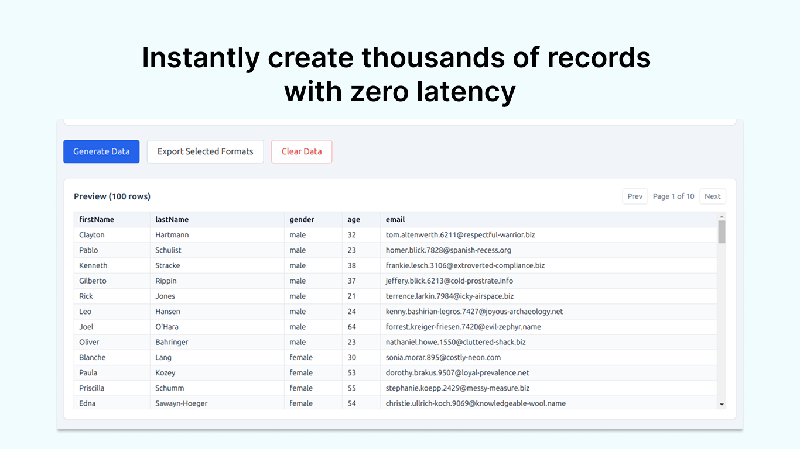
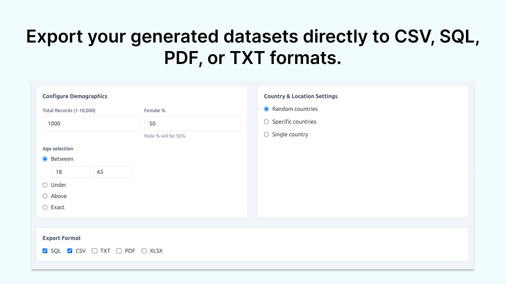
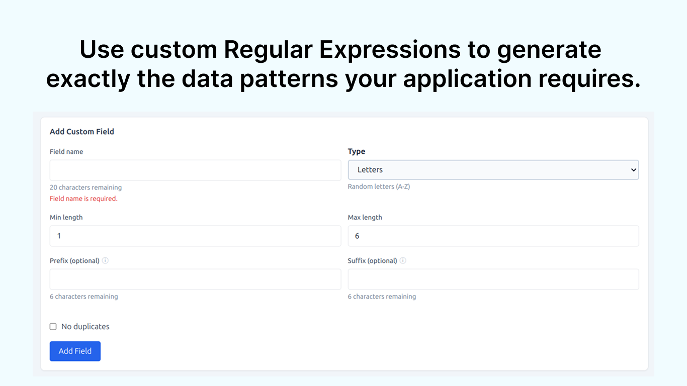
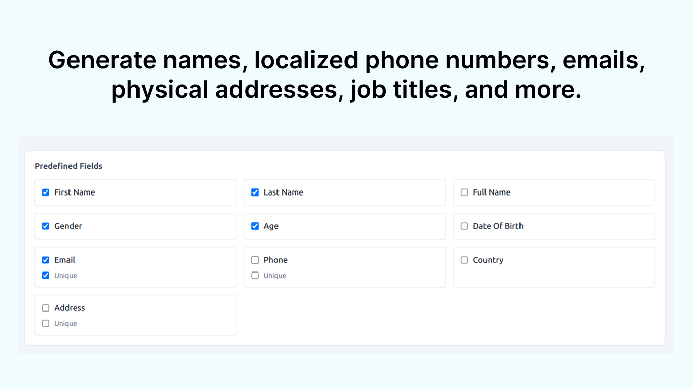

# Dummy Forge

Dummy Forge is a desktop app for generating realistic dummy data for educational and development use. Configure fields, demographics, locations, generate up to 10,000 records, and export to multiple formats.

## Features
- Generate up to 10,000 records per run
- Predefined fields:
	- Personal: first name, last name, full name, gender, age, date of birth
	- Contact: email (unique), phone, mobile, landline
	- Location: country, city, state/province, address, street, postal/zip code, latitude/longitude
	- Identifiers: student ID, employee ID, username, UUID
	- Temporal: created/updated timestamps, registration date
	- Financial (optional): credit card, IBAN, currency
- Custom fields with patterns and constraints:
	- Random strings, numbers, alphanumeric
	- Auto-increment (standard/custom)
	- UUID, boolean, UNIX timestamp, ISO date
	- Custom pattern (e.g., `XXX-####-XXX`)
	- Optional prefix/suffix and uniqueness
- Demographics configuration: gender distribution and age ranges
- Country modes: random, specific list, or single country
- Data preview before export
- Export formats: CSV, SQL, TXT, PDF

## Screenshots





## Tech Stack
- Electron + Vite + React
- TypeScript
- Tailwind CSS
- Node.js + Express
- SQLite (better-sqlite3)
- Faker, jsPDF, PapaParse

## Getting Started

### Prerequisites
- Node.js 20+
- npm (or compatible package manager)

### Install
```bash
npm install
```

### Run (dev)
```bash
npm run dev
```

### Build
```bash
npm run build
```

### Lint
```bash
npm run lint
```

## Project Structure
```
electron/            # Electron main process
server/              # Express API + data generation
src/                 # React UI
src/components/      # UI components
src/lib/             # Generators, exporters, utilities
types/               # Shared types
screenshots/         # App screenshots
```

## License
All rights reserved.