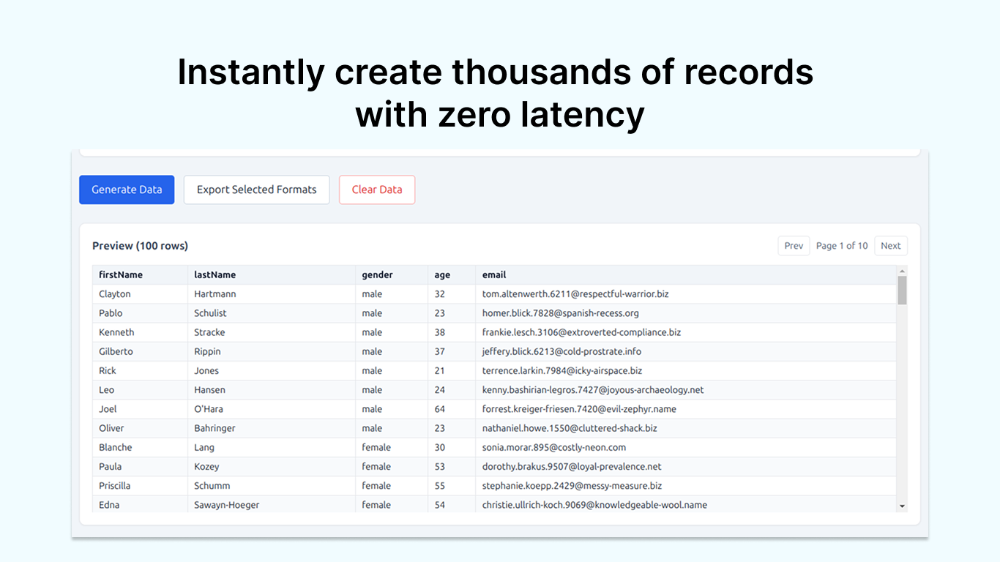
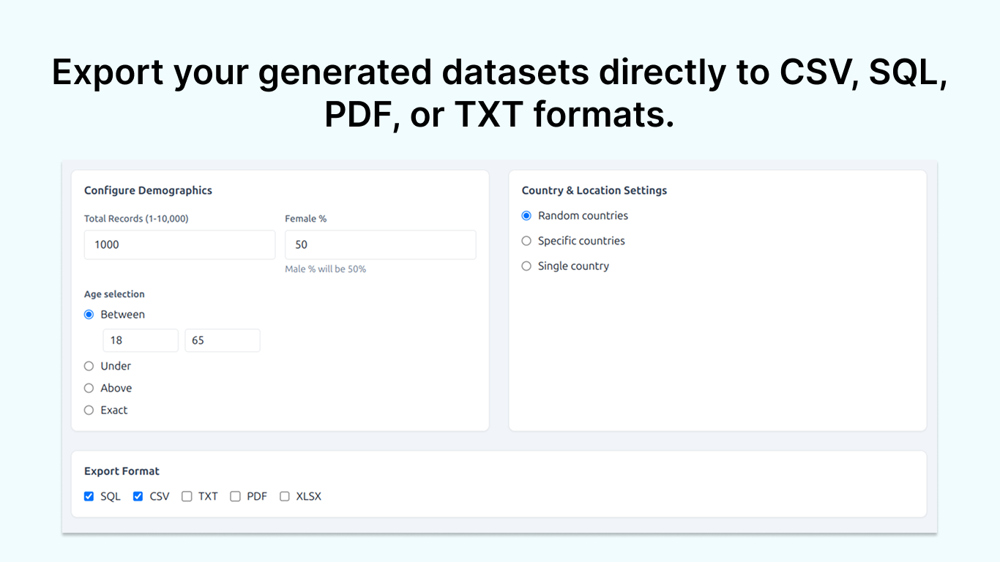
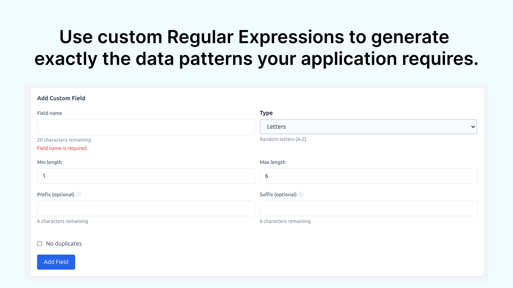
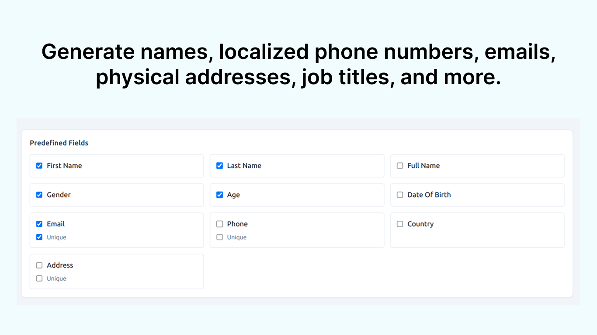

# Dummy Forge


Dummy Forge is a powerful desktop application for generating realistic, customizable dummy data for educational and development use. Configure fields, demographics, locations, generate up to 10,000 records, and export to multiple formats. Includes an integrated SQL Query Studio for practice and learning.

## Release 1.1.12 Highlights
- Added Query Studio with an in-app SQL practice console
- Improved SQL diagnostics and autocomplete suggestions
- Fixed country dial-code generation for single/specific/random country modes
- Added sticky tab navigation and dark/light theme toggle
- Refined dark mode contrast and readability

## Features
- Generate up to 100,000 records per run
- Query Studio for SQL practice with autocomplete, diagnostics, and pagination
- Dark/Light theme toggle for better readability
- Predefined fields:
	- Personal: first name, last name, full name, gender, age, date of birth
	- Contact: email (unique), phone, mobile, landline
	- Location: country, city, state/province, address, street, postal/zip code, latitude/longitude
	- Identifiers: student ID, employee ID, username, UUID
	- Temporal: created/updated timestamps, registration date
	- Financial (optional): credit card, IBAN, currency
- Custom fields with patterns and constraints:
	- Random strings, numbers, alphanumeric
	- Auto-increment (standard/custom)
	- UUID, boolean, UNIX timestamp, ISO date
	- Custom pattern (e.g., `XXX-####-XXX`)
	- Optional prefix/suffix and uniqueness
- Demographics configuration: gender distribution and age ranges
- Country modes: random, specific list, or single country
- Data preview before export
- Export formats: CSV, SQL, TXT, PDF

## Screenshots





## Tech Stack

**Frontend:**
- Electron (desktop framework)
- Vite (build tool)
- React (UI library)
- TypeScript (type safety)
- Tailwind CSS (styling)

**Backend:**
- Node.js + Express (API server)
- SQLite with better-sqlite3 (in-memory database)
- Faker.js (realistic data generation)
- jsPDF (PDF export)
- PapaParse (CSV handling)

**Development:**
- PostCSS (CSS processing)
- ESLint (code quality)
- Electron Builder (packaging & distribution)

## Getting Started

### Prerequisites
- **Node.js 20 or higher** (check with `node --version`)
- **npm** (included with Node.js) or **yarn/pnpm** as package managers
- **Git** (for cloning the repository)
- **Python 3.x** (optional, for build tools on some systems)

### Installation Steps

1. **Clone the repository:**
   ```bash
  git clone https://github.com/kanishkaGayan/Dummy-Forge.git
   cd dummy-forge
   ```

2. **Install dependencies:**
   ```bash
   npm install
   ```
   This installs all required Node.js packages and Electron.

3. **Environment Setup** (if needed):
   Create a `.env` file in the root directory if you need to configure custom ports or settings:
   ```
   VITE_API_PORT=5000
   NODE_ENV=development
   ```

### Run in Development Mode

```bash
npm run dev
```

This command:
- Starts the Vite development server
- Launches the Electron app
- Enables hot module reloading for quick development feedback
- Opens DevTools for debugging

### Build for Production

```bash
npm run build
```

This compiles React components and generates optimized bundles in the `build/` directory.

### Package distributables

Build Linux distributables (`AppImage`, `snap`, `deb`):
```bash
npm run package:linux
```

Build Windows distributable (`.exe` via NSIS):
```bash
npm run package:win
```

Build both Windows and Linux targets:
```bash
npm run package:all
```

Output artifacts are generated in the `release/` directory.

### Lint & Code Quality

```bash
npm run lint
```

Runs ESLint to check code quality and catch potential issues.

## Project Structure

```
electron/                  # Electron main process & IPC handlers
├── main.ts                # Main process entry point
├── preload.ts             # Preload script for IPC security
├── menu.ts                # Application menu definitions
└── autoUpdater.ts         # Auto-update logic

server/                    # Express API & data generation
├── index.ts               # Server entry point
├── types.ts               # Type definitions
├── database/              # Database initialization
├── lib/                   # Data generation logic
├── routes/                # API endpoints
└── utils/                 # Helper functions

src/                       # React frontend
├── components/            # React components
├── lib/                   # Generators, exporters, utilities
├── types/                 # TypeScript type definitions
├── App.tsx                # Main App component
└── main.tsx               # React entry point

build/                     # Build outputs
release/                   # Packaged distributables
```

## API Documentation

The application runs an internal Express server on `http://localhost:5000` by default.

### Available Endpoints

#### POST /api/generate
Generates dummy data based on provided configuration.

**Request Body:**
```json
{
  "count": 100,
  "fields": [...],
  "customFields": [...],
  "demographics": {...},
  "countryMode": "random"
}
```

**Response:**
```json
{
  "success": true,
  "data": [...],
  "count": 100
}
```

#### POST /api/export
Exports generated data in specified format (CSV, SQL, JSON, PDF, TXT).

**Request Body:**
```json
{
  "data": [...],
  "format": "csv",
  "tableName": "users"
}
```

#### GET /api/countries
Returns list of all available countries with dial codes.

## Troubleshooting

### Common Issues

**1. "Module not found" errors on startup**
- Solution: Delete `node_modules/` and reinstall:
  ```bash
  rm -rf node_modules package-lock.json
  npm install
  ```

**2. Electron app fails to start in development**
- Ensure Vite dev server is running on port 5173
- Check that no other process is using port 5000 (API server)
- Clear Electron cache: `rm -rf ~/.config/dummy-forge`

**3. Build/package fails**
- Verify Node.js version: `node --version` (should be 20+)
- On Linux, ensure build tools are installed: `sudo apt install build-essential python3`
- Clear cache: `npm run build:clean && npm install`

**4. Data export fails**
- Ensure the output directory has write permissions
- Check available disk space
- Try exporting to a different format

**5. Query Studio shows SQL errors**
- Review SQL syntax against SQLite documentation
- Check table name matches your exported data structure
- Use the autocomplete suggestions for available functions

### Debug Mode

To run with debugging enabled:
```bash
# Set environment variable
DEBUG=dummy-forge npm run dev
```

Access DevTools in the Electron app via **View → Toggle Developer Tools**.

## Contributing

Contributions are welcome! Please follow these guidelines:

### Getting Started

1. Fork the repository
2. Create a feature branch: `git checkout -b feature/your-feature`
3. Make your changes following the code style
4. Run tests and linting: `npm run lint`
5. Commit with clear messages: `git commit -m "Add: your feature description"`
6. Push and create a Pull Request

### Code Style

- Use TypeScript for type safety
- Follow ESLint rules (run `npm run lint`)
- Use functional components with React hooks
- Add comments for complex logic
- Keep components focused and reusable

### Testing

- Test your changes thoroughly before submitting
- Test on both Windows and Linux if possible
- Verify export formats produce valid files
- Test with edge cases (empty data, special characters, large datasets)

### Reporting Issues

When reporting bugs, please include:
- Operating system and version
- Node.js and npm versions
- Steps to reproduce the issue
- Error messages or screenshots
- Expected vs actual behavior

### Feature Requests

Feature requests are welcome! Please describe:
- The problem your feature solves
- Proposed solution and alternatives
- Any relevant examples or mockups

## License

All rights reserved. See [LICENSE](./LICENSE) for details.
